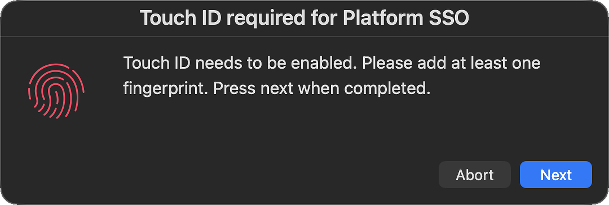
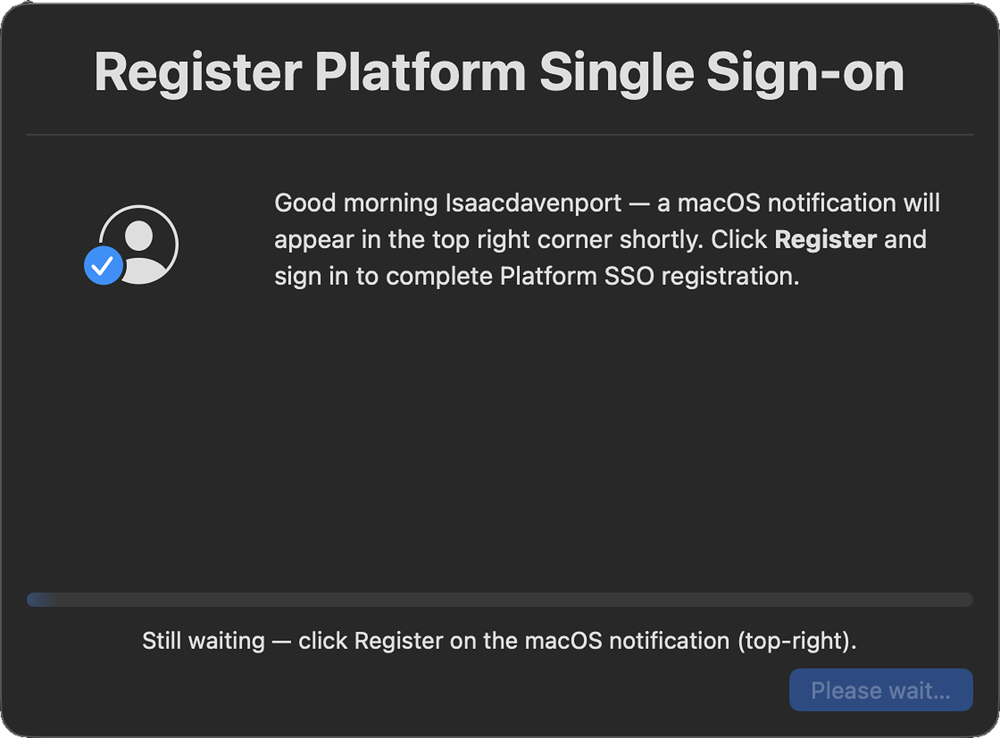
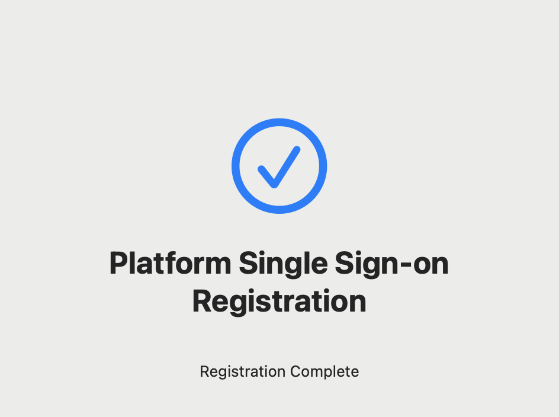

# Force Platform SSO

**Detects Macs that never completed Platform SSO registration and drives the user through it.**

Apple's Platform SSO registration is user-initiated. On an already-enrolled Mac the configuration profile installs correctly while the registration prompt can go unseen — leaving the device with the profile present, registration incomplete and device trust never established. Nothing errors, and nothing in a dashboard shows it.

This script closes that gap without Jamf triggers, API calls or scope changes, so it runs on any device where the profile and Company Portal are already present.

---

## What the user sees

The whole flow is four screens. From the user's side it is a prompt, a sign-in and a confirmation — no ticket, no walkthrough call.

### 1 · Touch ID gate

Platform SSO's secure enclave key is bound to a local biometric, so the script optionally checks Touch ID enrolment before anything else. If no fingerprint is enrolled, it opens the Touch ID pane in System Settings and holds here until the user adds one. **Abort** exits cleanly rather than pushing the user into a registration that would fail.

  

This screen is skipped entirely when `$4` is set to `no`, or when the Mac has no Touch ID hardware.

### 2 · Status card

The card opens bottom-right and stays up for the whole run. It greets the user by first name, tells them exactly where the prompt will appear, and shows a live progress bar tied to the polling loop — so the window is never a dead box the user is tempted to close.

Behind it, the script restarts `AppSSOAgent` to re-fire the registration prompt that was originally missed.

  

The button is deliberately disabled — there is nothing to click here. The only action is on the notification. If Focus mode is on, the card adds a line telling the user to open Notification Center instead, since the banner will be suppressed.

The progress text tracks the loop, rotating between `Waiting for you to click Register…` and `Still waiting — click Register on the macOS notification (top-right).` every 30 seconds so the card never looks frozen.

### 3 · The registration prompt

This is the notification the restart re-fires — the same one that went unseen the first time. Clicking it opens the identity provider sign-in.

  

### 4 · Registration complete

The poll sees `registrationCompleted` and the card switches to `Finalizing…` while `jamfAAD` runs, so the compliance step is done before the user is told they are finished. The card then shows its completed state, closes itself, and the script exits `0`.

  

On timeout the card is replaced by a failure modal explaining what to try, and the script exits `1` so the Jamf policy reports the failure instead of silently claiming success.

---

## How it works

1. Installs or updates swiftDialog from GitHub, verifying the developer Team ID before install
2. Optionally enforces Touch ID enrolment, and enables Company Portal extensions best-effort
3. Shows a status card and restarts `AppSSOAgent` to re-fire the registration prompt
4. Polls `app-sso platform -s` for `registrationCompleted`, updating the card
5. On success runs `jamfAAD` and exits 0; on timeout shows a failure modal and exits 1

## Jamf parameters

| Parameter | Purpose |
|---|---|
| `$3` | Logged-in user (passed by Jamf) |
| `$4` | Check for Touch ID enrolment — default `yes` |
| `$5` | Run `jamfAAD` on error — default `yes` |
| `$6` | Maximum wait in seconds — default `300` |
| `$7` | Status card lifetime — defaults to `$6` + 30s |

## Deployment

Production use was against Microsoft Entra ID across a 300-device fleet; the flow was also validated against Okta in a developer tenant.

## Requirements

Platform SSO configuration profile and Company Portal already deployed.
