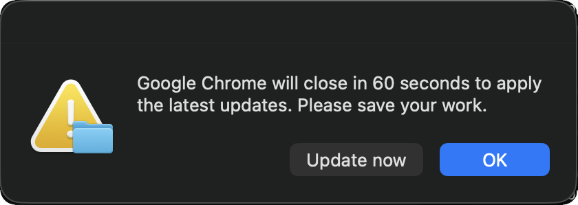

# Google Chrome Latest

**Installs the current Chrome release from Google's CDN.**

Warns the user, waits, quits Chrome, installs, then relaunches it if it was running.

  

The prompt appears only when Chrome is actually running; with it closed the install proceeds silently. *OK* takes the full 60 seconds, while *Update now* skips the wait for anyone who has already saved — the button that sounds like acknowledgement is the one that buys time.

---

## Ordering matters here

The warning and quit happen *before* the install. Installing over a running Chrome and warning afterwards updates the browser underneath the user, which is what an earlier version of this script did.

## Notes

Dialogs and the relaunch run via `launchctl asuser` so they appear in the user's session. A graceful quit is attempted first, with a `killall` fallback only if Chrome ignores it. Download and install failures relaunch Chrome rather than leaving the user with nothing.
