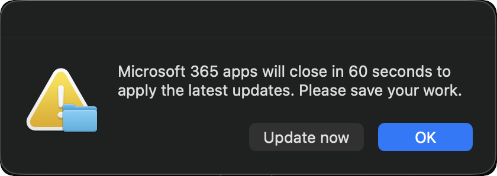

# Office 365 Latest

**Installs the current Microsoft 365 suite from Microsoft's CDN.**

Detects which Office apps are open, warns the user, waits, quits them, installs, then relaunches only what was originally running.

  

The prompt appears only when at least one Office app is open, and only those apps are reopened afterwards — someone running Word alone does not come back to Excel and PowerPoint as well. *OK* takes the full 60 seconds, while *Update now* skips the wait.

---

## Notes

As with the Chrome script, the warning and quit precede the install. Dialogs and relaunches run in the user's session, with a `killall` fallback for apps holding unsaved-work dialogs.
