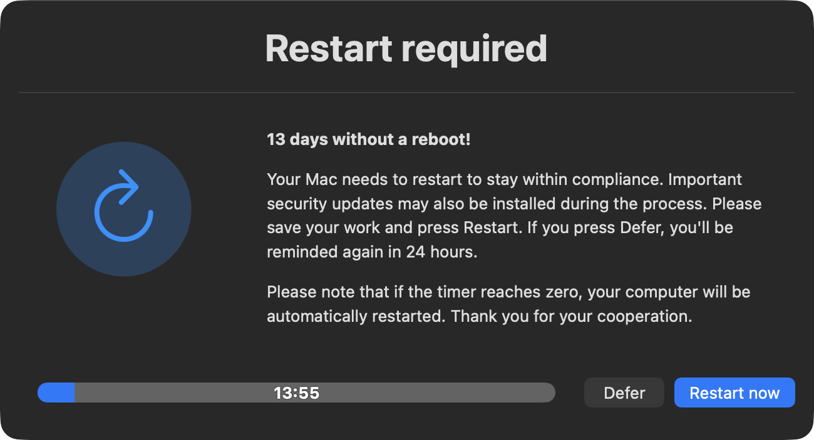
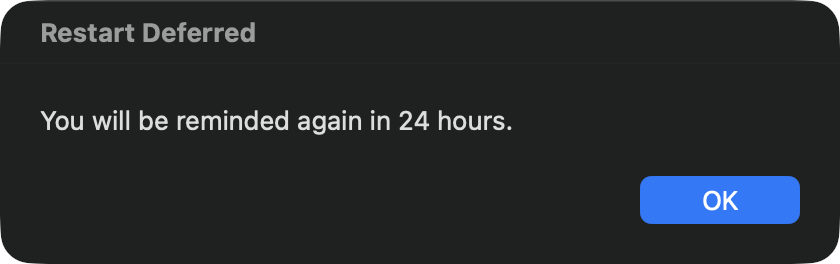
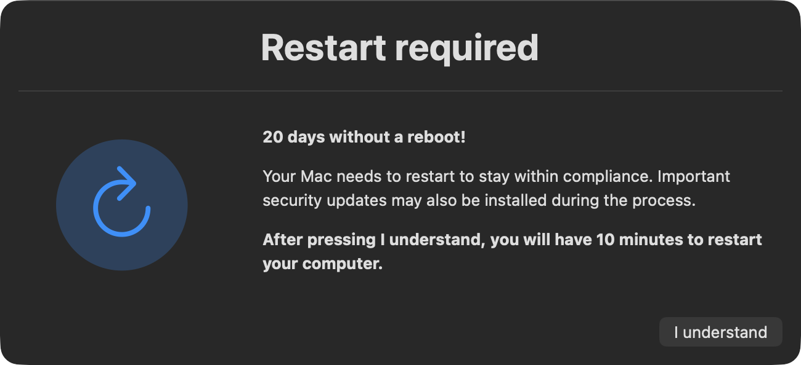
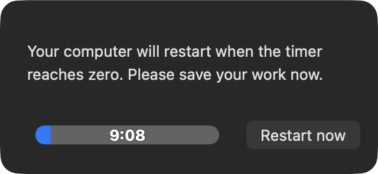

# Restart Mac

**Prompts for a restart with pressure that escalates on uptime.**

A patch that is downloaded but never restarted into is not applied, while inventory may still report the device compliant. This script drives the restart, escalating as uptime grows.

| Uptime | Behaviour |
|---|---|
| 6 days or less | Nothing — no prompt, no network calls |
| 7–13 days | *Restart now* / *Defer*, 15-minute timer, asks again in 24 hours |
| 14 days or more | No defer. Acknowledge, then a 10-minute countdown to an automatic restart |

Uptime is computed from `kern.boottime`. swiftDialog is only installed or updated once a dialog is actually warranted, so machines under the threshold never touch the GitHub API.

---

## What the user sees

Two tiers, four windows. The wording and the available buttons are what change between them, so the escalation is visible to the user and not only in the policy log.

### 1 · Deferrable prompt — 7 to 13 days

The day count leads the message, so the user sees how far past the threshold they are rather than a generic nag. *Defer* is a real choice at this tier, and the message says exactly what it costs: another prompt in 24 hours.

  

The window opens bottom-right and stays movable, so it never parks itself on top of the work the user is being asked to save. If the timer reaches zero with nobody at the keyboard, the restart proceeds — this dialog is notice, not a permission gate.

### 2 · Deferral confirmation

Pressing *Defer* confirms in plain terms when the prompt will return. Without it the window simply disappears, which reads as "dismissed for good" rather than "postponed".

  

### 3 · Final warning — 14 days or more

Past 14 days *Defer* is gone. The only button is *I understand*, and the consequence is spelled out in bold above it — before the click rather than after.

  

This tier passes `--blurscreen`, so the warning lands over a blurred desktop and is hard to mistake for a background notification.

### 4 · Countdown to automatic restart

Acknowledging starts a 10-minute countdown. This window is deliberately stripped — `--title none`, `--icon none` — because at this point there is no decision left to present, only time to save work. *Restart now* skips the remaining wait.

  

---

## Jamf parameters

| Parameter | Purpose |
|---|---|
| `$4` | Dialog icon — a branding-image URL, file path, or SF Symbol spec. Defaults to a system restart glyph. |

## Testing

There is a commented-out `uptime_days` override just below the `kern.boottime` calculation. Set it to `13` to reach the deferrable tier or `20` for the final warning, and re-comment it before deploying — left uncommented it overrides the real uptime check on every machine.
